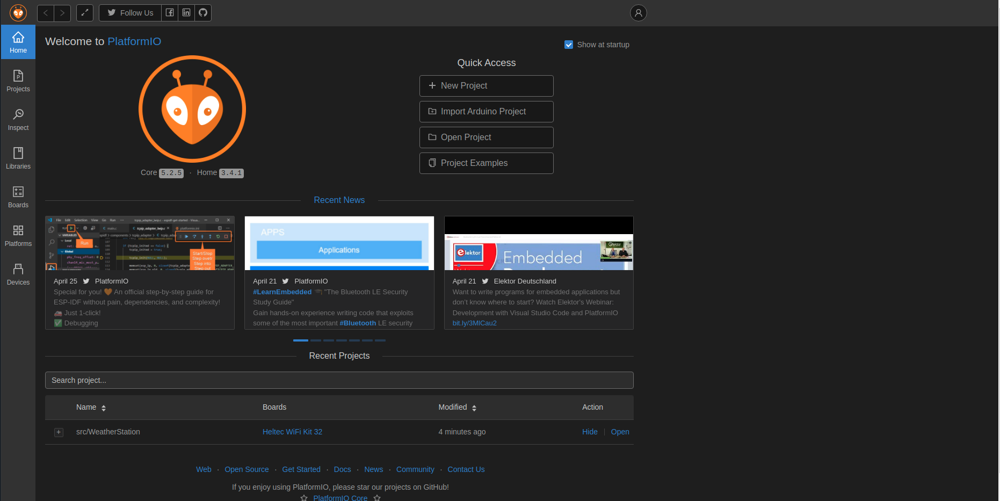

# Portable Weather Station

## Installation Steps

This project was developed using the PlatformIO IDE, which is an extension for
Visual Studio Code. The following steps are required to install the project from
scratch:

- Download or pull this repository to your computer's local file system.
- Install [Visual Studio Code](https://code.visualstudio.com/).
- Add the [PlatformIO](https://platformio.org/install) extension to VS Code.
- With VSCode open, press ``Ctrl+Shift+P`` to open the command prompt, then type
  ``PlatformIO: Home`` and hit enter. The screen below will appear:

  

- Click on the "Open Project" button and locate the folder containing the
  project in the file explorer. This is all that is needed to set up the
  development environment!
- If the source code is modified, it can be quickly compiled to check for errors
  by opening the command prompt with ``Ctrl+Shift+P``, typing
  ``PlatformIO: Build``, and hitting enter.
- To flash the program onto a new ESP32 microcontroller, open the command
  prompt, type ``PlatformIO: Upload``, then hit enter. Alternatively, the
  default shortcut ``Ctrl+Alt+U`` can be used to upload the program without
  using the command prompt.

  ## Project Structure
  The files relevant for developing this project are given below:

  - ``platformio.ini``: The configuration file for the development environment.
    Notably, this file contains a list of external libraries that were used for
    the project. When a build or upload command is performed, PlatformIO checks
    these dependencies and automatically installs them if they are not already
    present. All dependencies installed through this method are stored in the
    ``.pio/libdeps`` folder.
  - ``src/WeatherStation.cpp``: The primary driver script for the project.
    Initializes all hardware and runs the main event loop.
  - ``include/bluetooth.h``: Defines all objects and functions needed to send
    data over a Bluetooth Low Energy (BLE) link. This header can be easily
    extended if additional BLE characteristics are desired.
  - ``include/constants.h``: Defines all constants used in the project as macros.
  - ``include/display.h``: Defines the functionality of the OLED
    and TFT displays, including object definitions and initializations, update
    logic, and user inputs through the three-button interface (TFT display
    only).
  - ``include/file.h``: Handles data logging to the microSD card.
  - ``include/pindefs.h``: Defines the pin assignments of each hardware
    component on the ESP32 microcontroller. For the most part, this file
    **should not be modified**.
  - ``include/sensors.h``: Defines sensor objects and functions to read sensor
    data, along with the data structure used to neatly pass the sensor data
    throughout the program.
  - ``include/settings.h``: Defines a struct that stores the project settings
    (as shown on the TFT screen) and sets their default values.
